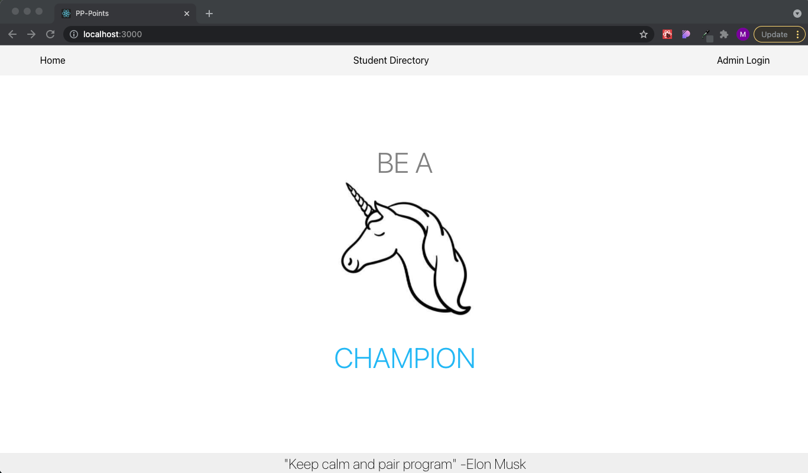

<strong><h1>App Summary :unicorn:</h1></strong>
The PP-Points Tracker app is an application enabling DevMountain faculty to effectively track and monitor students Pair Programming progress. 

<strong><h1>MVP</h1></strong>

<h2>App Functionality</h2>
<ul>
<li>App will have a student facing directory allowing the students to monitor and track their current points.</li>
<li>App will allow students to search through the directory based off the name of their cohort.</li>
<li>App will allow admins to add students to the directory.</li>
<li>App will allow admins to adjust the points for individual students.</li>
<li>App will allow admins notate whether or not students have recieved rewards at the predetermined intervals.</li>
<li>App will allow admins to add/delete students on a necessary basis.</li>
</ul>

<strong><h1>Landing Page</h1></strong>

<strong><h1>Student Facing Directory</h1></strong>

<strong><h1>Admin Login</h1></strong>

<strong><h1>Adding a Student</h1></strong>

<strong><h1>Deleting a Student</h1></strong>

